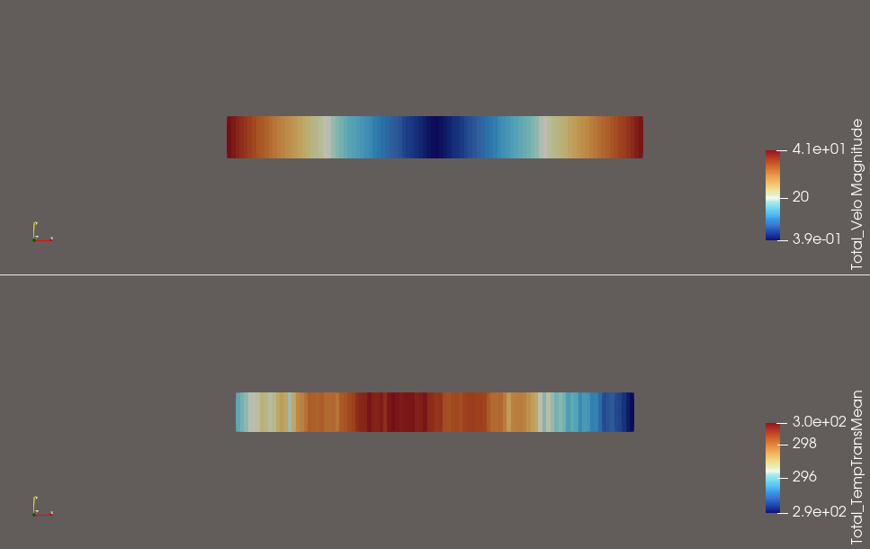

# Leon's Gas Kinetics
This is a little Julia-based DSMC gas kinetics solver.
It supports the BGK collision model and 3D geometries.

## Usage
Example files are provided in the `examples` folder.
The mesh .h5 files are generated using the [HOPR preprocessor](https://github.com/hopr-framework/hopr).

```
julia --project=. src/LeonsGasKinetics.jl examples/couette.toml output_path_of_choice
```
Visualization uses the `piclas2vtk` utility from the [PICLas project](https://github.com/piclas-framework/piclas).
```
piclas2vtk output_path_of_choice/Couette_*.h5
paraview output_path_of_choice/*.vtu
```

## Demo
### Couette
Wall velocity = +-100m/s, Kn=1.0  


# References
- https://github.com/piclas-framework/piclas
- C.D. Munz et al, _Coupled Particle-In-Cell and Direct Simulation Monte Carlo method for simulating reactive plasma flows_. 2014
- G.A. Bird, _Molecular Gas Dynamics and the Direct Simulation of Gas Flows_. 1994
- M. Pfeiffer, _Particle-based fluid dynamics: Comparison of different Bhatnagar-Gross-Krook models and the direct simulation Monte Carlo method for hypersonic flows_. 2018

# License
Leon's Gas Kinetics  Copyright (C) 2025  Leon Teichroeb  
This program comes with ABSOLUTELY NO WARRANTY.  
This is free software, and you are welcome to redistribute it
under certain conditions; for details view LICENSE.