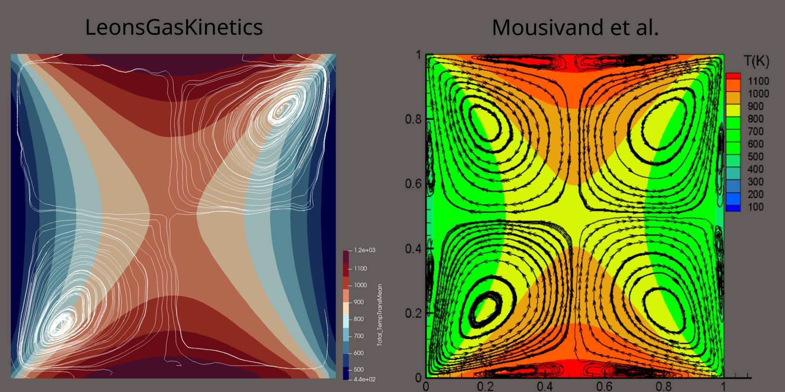
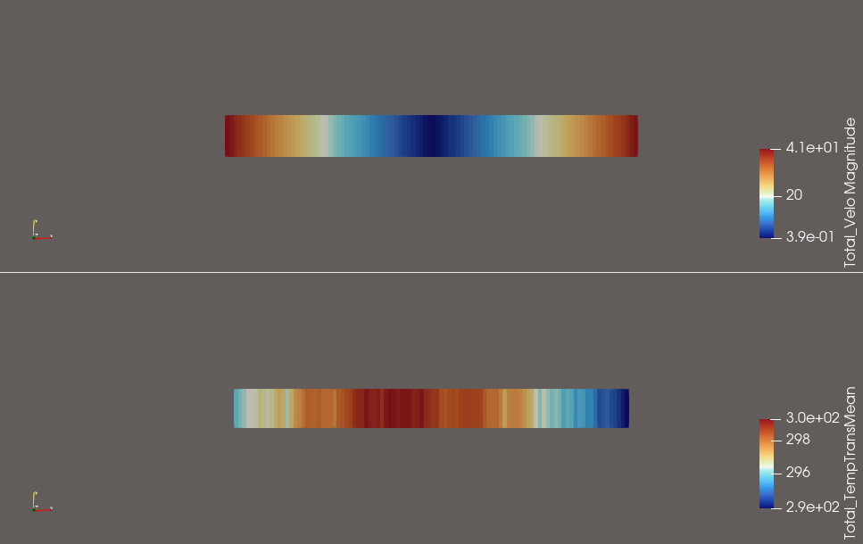

# Leon's Gas Kinetics
[](https://git.leons-tech.org/lte678/LeonsGasKinetics/-/commits/master)  

This is a little Julia-based DSMC gas kinetics solver.
It supports the BGK collision model and 3D geometries.
A rather uncommon feature is a variance reduction scheme called "VRBGK" that allows for low-noise, low-velocity BGK simulations. 

## Usage
Example files are provided in the `examples` folder.
The mesh .h5 files are generated using the [HOPR preprocessor](https://github.com/hopr-framework/hopr).

```
julia --project=. src/main.jl examples/couette/couette.toml output_path_of_choice
```
Visualization uses the `piclas2vtk` utility from the [PICLas project](https://github.com/piclas-framework/piclas).
```
piclas2vtk output_path_of_choice/Couette_*.h5
paraview output_path_of_choice/*.vtu
```

## Demo

### Rarefied thermally-driven cavity flow
Flow driven by thermal transpiration. Kn=0.1, T_cold = 300K, T_hot=1500K  
(Streamlines are plotted for bottom-left and top-right corners.)



Reference: M. Mousivand and E. Roohi, "_On the Rarefied Thermally-Driven Flows in Cavities and Bends_". 2022

### 1D Couette
Wall velocity = +-100m/s, Kn=1.0  


# References
- https://github.com/piclas-framework/piclas
- C.D. Munz et al, "_Coupled Particle-In-Cell and Direct Simulation Monte Carlo method for simulating reactive plasma flows_". 2014
- G.A. Bird, "_Molecular Gas Dynamics and the Direct Simulation of Gas Flows_". 1994
- M. Pfeiffer, "_Particle-based fluid dynamics: Comparison of different Bhatnagar-Gross-Krook models and the direct simulation Monte Carlo method for hypersonic flows_". 2018
- C.D. Landon and N. G. Hadjiconstantinou, "_Variance-Reduced Direct Simulation Monte Carlo with the Bhatnagar-Gross-Krook Collision Operator_". 2011
- A.L. Garcia, W. Wagner, "_Generation of the Maxwellian inflow distribution_". 2006
- Duff et al, "_Building an Orthonormal Basis, Revisited_". 2017

# License
Leon's Gas Kinetics  Copyright (C) 2026  Leon Teichroeb  
This program comes with ABSOLUTELY NO WARRANTY.  
This is free software, and you are welcome to redistribute it
under certain conditions; for details view LICENSE.